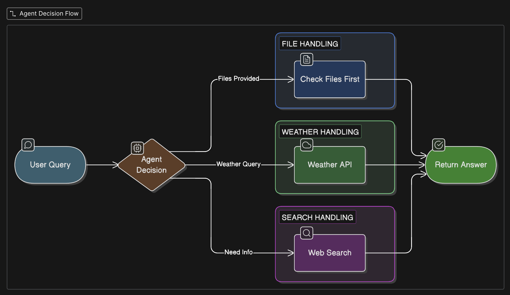

# 🧠 DevPilot - AI Agent That Actually Helps

> An intelligent AI agent that checks your files first, then searches the web. Powered by local LLMs - zero cloud costs.


## 📋 What It Does

An AI agent that intelligently answers your questions by:
1. Checking uploaded files first
2. Fetching real-time weather data when needed
3. Searching the web as a fallback




## 🚀 Quick Start

```bash
# 1. Install Ollama
brew install ollama
ollama pull llama3.2

# 2. Clone & Setup
git clone https://github.com/gpavankumarnov/whether-api-agent.git
cd whether-api-agent
cp .env.example .env

# 3. Run
uv run main.py --query "What's the weather in Delhi?"
```

## 🛠️ Tech Stack

- **LangChain + LangGraph** - Agent orchestration
- **Ollama (llama3.2)** - Local LLM (no API costs)
- **OpenWeatherMap API** - Real-time weather
- **DuckDuckGo** - Web search

## 💡 Key Features

**1. File-First Approach**
```bash
uv run main.py --query "Explain this code" --files main.py
```
Agent checks your files before searching the web.

**2. Real-Time Weather**
```bash
uv run main.py --query "Weather in Mumbai?"
```
Fetches live data from OpenWeatherMap.

**3. Smart Web Search**
```bash
uv run main.py --query "Who is Narendra Modi?"
```
Answers directly or searches DuckDuckGo when needed.

## 📊 How It Works

```
User Query → Agent (Ollama) → Decision:
                                ├─ Files? → Read & Answer
                                ├─ Weather? → API Call
                                └─ Unknown? → Web Search
```

## 📁 Project Structure

```
├── main.py          # Agent logic
├── app.py           # Streamlit UI
├── .env             # API keys
└── requirements.txt # Dependencies
```

## 🎯 Technical Decisions

**Why Ollama over cloud APIs?**
- Zero cost, unlimited usage
- Complete privacy (runs locally)
- No internet dependency

**Why check files first?**
- Faster responses
- More accurate context
- Reduces unnecessary API calls

## 📝 License

MIT


